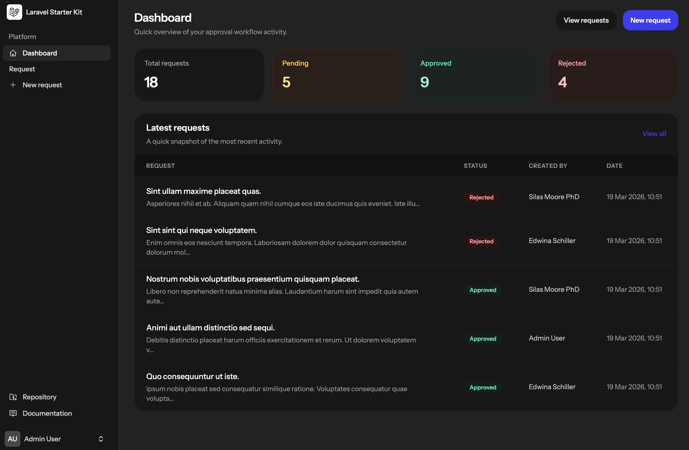
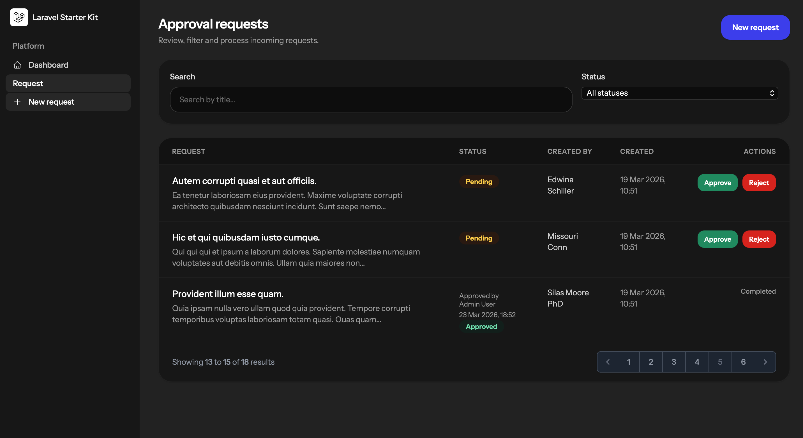
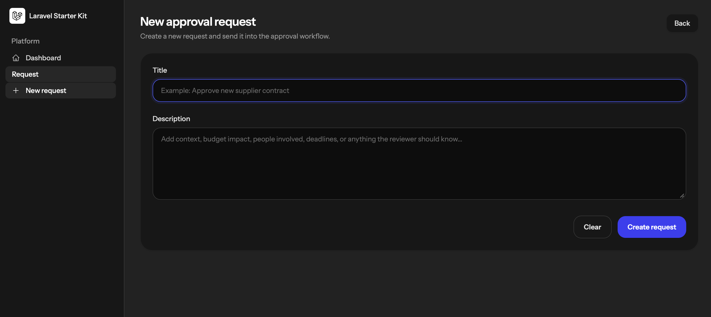

# 🚀 ApprovalFlow (Laravel + Livewire)

A lightweight internal workflow tool built with Laravel 13 and Livewire 4.  
Designed to manage approval requests through a simple and clean approval lifecycle.

---


---

## ✨ Features

* 🔐 Authentication system (Laravel Breeze)
* 📝 Create approval requests
* 📋 Request listing with filters and search
* ✅ Approve / reject workflow
* 📊 Dashboard with key metrics
* 👤 User tracking (creator, approver, rejector)
* 🧭 Clean internal tool UI (Flux + Tailwind)
* ⚡ Real-time interactions with Livewire

---

## 🔄 Workflow

1. User creates a request (title + description)
2. Request enters **pending** state
3. Request can be:
    - ✅ Approved
    - ❌ Rejected
4. System stores:
    - Who made the decision
    - When it happened
    - Optional decision note

---

## 🛠️ Tech Stack

* **Laravel 13**
* **Livewire 4**
* **Flux UI**
* **TailwindCSS**
* **MySQL**
* **Pest**

---

## 🧱 Architecture

* MVC + Livewire components
* Domain logic inside the model (approve/reject methods)
* Clean separation of concerns:

    * `ApprovalRequest` (domain logic)
    * Livewire components:
        * `Create`
        * `Index`
        * `Dashboard`

* URL-driven filters (status & search)
* Pagination + real-time UI updates

---

## 📸 Screenshots (coming soon)

> Add screenshots here to showcase:
>
> * Dashboard
> * Requests listing
> * Create form

---

## ⚙️ Installation

```bash
git clone git@github.com:AlbertoKaz/approvalflow.git
cd approvalflow

composer install
npm install

cp .env.example .env
php artisan key:generate

php artisan migrate --seed

npm run dev
php artisan serve


---

## 🔑 Environment Setup

Configure your `.env` file:

```env
DB_DATABASE=approvalflow
DB_USERNAME=root
DB_PASSWORD=

Email: admin@example.com
Password: password

---

## 📌 Roadmap

* Decision notes UI (modal or inline)
* Role-based permissions (admin/reviewer)
* Activity timeline per request
* Email notifications on decision
* API endpoints (future SaaS version)
* Tests with Pest (workflow coverage)

---

## 🤝 About the Project

This project was built as a portfolio-ready mini SaaS to demonstrate:

* Workflow-based application design
* Livewire real-time UX
* Clean domain-driven logic
* Internal tool UI patterns
* Scalable Laravel architecture

## 📸 Screenshots

### Dashboard


### Invoices


### Stripe


---


## 📬 Contact

Developed by **Alberto Mendoza**
Fullstack Laravel Developer

---

⭐ If you like this project, feel free to star the repository!
